# Day 03: Introduction to STM32CubeIDE  
📅 Date: 19-02-2025
🔄 last updated: 20-02-2025

✍️ Author: [Sandip Maity](https://github.com/iam-sandipmaity) | [Twitter](https://x.com/iam_sandipmaity) | [LinkedIn](https://www.linkedin.com/in/iam-sandipmaity/) | [Instagram](https://www.instagram.com/iam_sandipmaity/) | [Telegram](https://t.me/iam_sandipmaity) 

---

## 📑 Table of Contents (Day 03)    
- [🎯 Objective](#-objective)
- [🧠 Theoretical Overview](#-theoretical-overview)
  - [🛠️ Introduction](#️-introduction)
  - [❓ What is STM32CubeIDE?](#-what-is-stm32cubeide)
    - [🔑 Key Components](#-key-components)
    - [💡 Benefits for Developers](#-benefits-for-developers)
  - [🔧 Installation of STM32CubeIDE](#-installation-of-stm32cubeide)
    - [📋 Prerequisites](#-prerequisites)
    - [📝 Installation Steps](#-installation-steps)
- [🌐 Resources & References](#-resources--references)
- [🙏 Contribution](#-contribution)

---

## 🎯 Objective  
- A detailed overview of STM32CubeIDE, including its features, installation, and setup.
- Setup the development environment for STM32CubeIDE.
- Create a new project in STM32CubeIDE.
- Build and run the first program in STM32CubeIDE.

---
## 🧠 Theoretical Overview  

### 🛠️ Introduction  
When working with embedded systems, choosing and using the right development tools is essential for writing good programs efficiently. Think of it like having the right tools when fixing a car - you need the proper wrenches and diagnostic equipment to do the job well.

For STM32 microcontrollers specifically, we'll be learning about STM32CubeIDE - which is like a complete workshop of tools all in one place. This IDE (Integrated Development Environment) is specially designed to make programming STM32 microcontrollers easier and more productive.

Just like how a good workshop needs proper organization of tools, lighting, and workspace, STM32CubeIDE provides everything we need in an organized way:
- A place to write our code
- Tools to check if our code is correct
- Ways to load our program onto the microcontroller
- Features to help us find and fix problems

We'll explore how this essential tool can help us build amazing embedded systems projects step by step.

### What is STM32CubeIDE?
STM32CubeIDE is a comprehensive, free integrated development environment (IDE) created by STMicroelectronics specifically for STM32 microcontroller development. It seamlessly combines the powerful STM32CubeMX configurator with advanced coding and debugging capabilities, providing developers with everything they need in one package.

#### Key Components
1. **Development Environment**
   - Eclipse-based IDE platform
   - Integrated STM32CubeMX configurator
   - Support for entire STM32 portfolio
   - Regular updates and new features

2. **Core Features**
   - Code editor with syntax highlighting
   - Project configuration and generation
   - Built-in compilation tools
   - Advanced debugging capabilities
   - Pin and peripheral configuration

3. **User Interface**
   - Intuitive project creation wizard
   - Code editor with auto-completion
   - Visual configuration tools
   - Comprehensive documentation
   - Easy navigation system

4. **Debug Capabilities**
   - Real-time variable monitoring
   - Breakpoint management
   - Step-by-step code execution
   - Memory and register inspection
   - SWV (Serial Wire Viewer) tracing

5. **Development Tools**
   - GCC compiler integration
   - C/C++ programming support
   - Code analysis features
   - Version control integration
   - Resource optimization tools

#### Benefits for Developers

- **Beginners**: 
  - Offers an easy learning curve with graphical tools
  - Provides comprehensive documentation and tutorials
  - Includes example projects to get started quickly

- **Experienced Users**: 
  - Provides advanced features for complex projects
  - Supports custom configurations and optimizations
  - Includes powerful debugging and tracing tools

- **All Users**: 
  - Free, complete solution for STM32 development
  - Regular updates and new features
  - Cross-platform support (Windows, Linux, MacOS)

- **Teams**: 
  - Supports collaborative development with version control
  - Facilitates code sharing and project management
  - Integrates with popular version control systems like Git

- **Educators**: 
  - Ideal for teaching embedded systems and microcontroller programming
  - Provides resources for creating course materials and labs
  - Supports remote learning with online tools and resources

- **Hobbyists and Makers**: 
  - Accessible for DIY projects and prototyping
  - Community support and forums for troubleshooting
  - Compatible with various hardware extensions and shields

### 📦 Installation of STM32CubeIDE

#### Prerequisites
| **Requirement** | **Specification** |
|-----------------|-------------------|
| Storage         | At least 4GB Free Space      |
| RAM             | 8GB recommended   |

#### Installation Steps
1. **Download the Installer**
   - Begin by searching for "STM32CubeIDE Download" using your preferred search engine. This will guide you to the official download page.
   - Click on the first search result to proceed.
   
    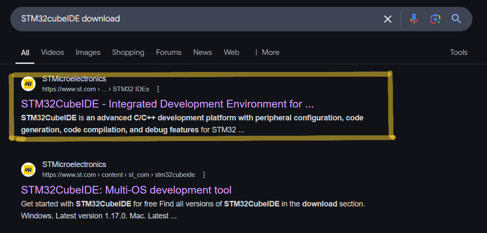
   
   - Alternatively, you can directly visit the [STM32CubeIDE download page](https://www.st.com/en/development-tools/stm32cubeide.html) for a more direct approach.

   - On the download page, locate and click the "Get Software" button to proceed further.
   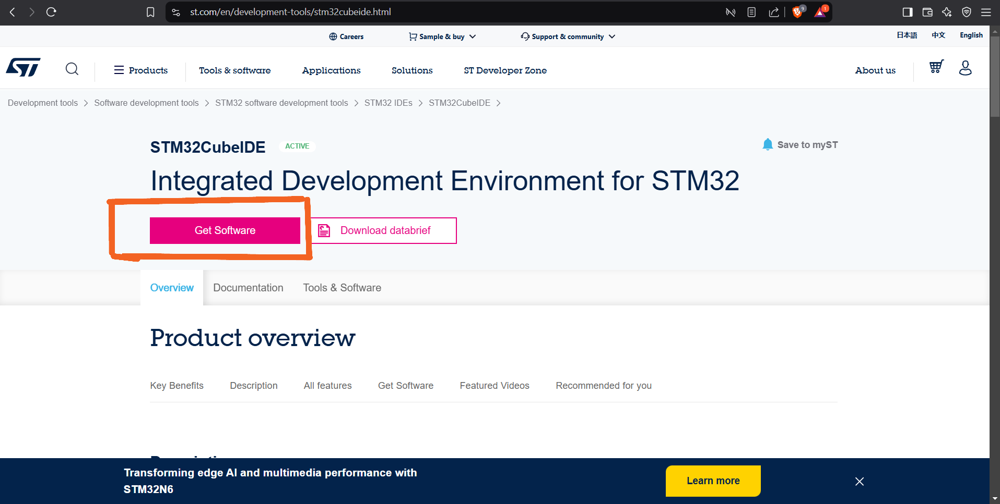
   
   - Select the appropriate operating system for your computer from the available options: Windows, Linux, or MacOS.

   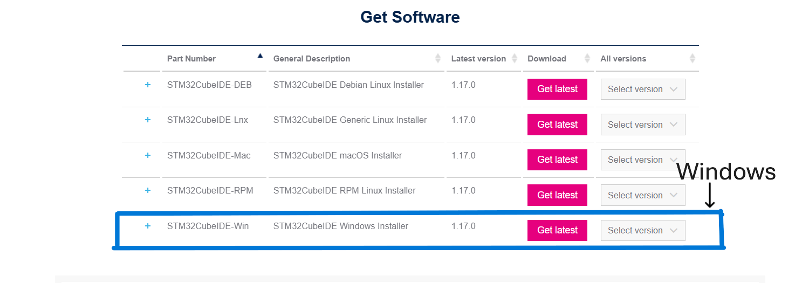

   - Next, choose the correct version of the software that matches your system requirements.

   - Click on the desired version (e.g., 1.17.0) to begin downloading the installer.    

   

   - You will be presented with two options: either create a free account or log in with an existing account. Alternatively, you can opt to download as a guest user.

   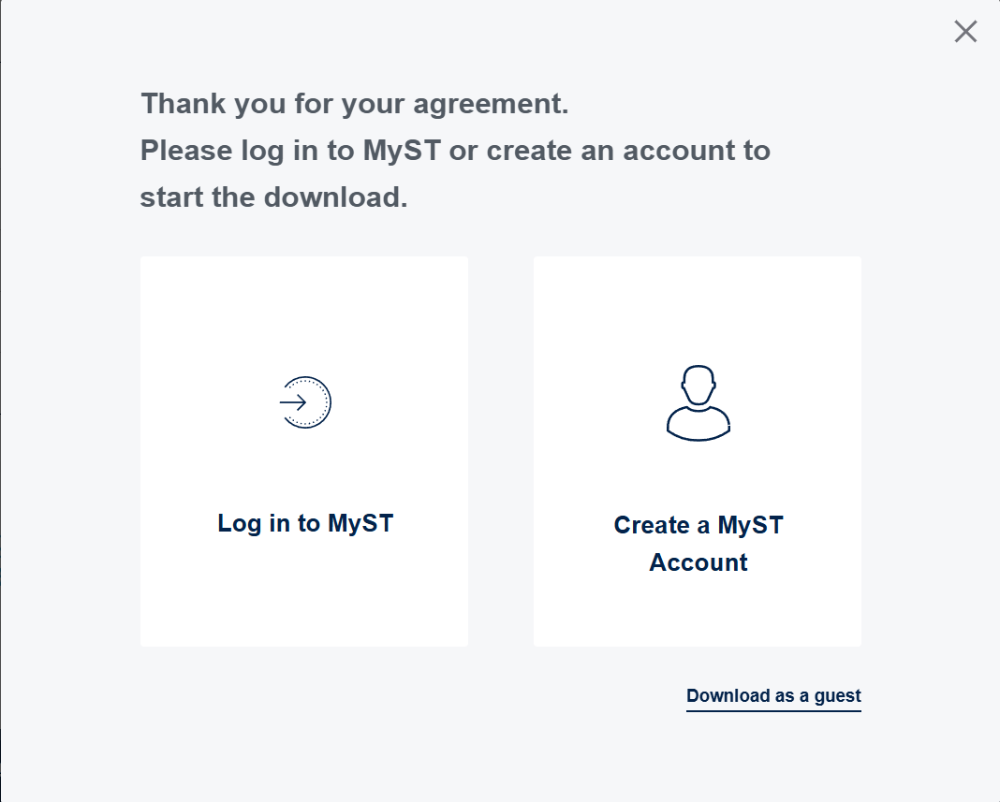

   - Select the option that best suits your needs and complete any required information.

   - Finally, click the "Download" button to start the download process.

   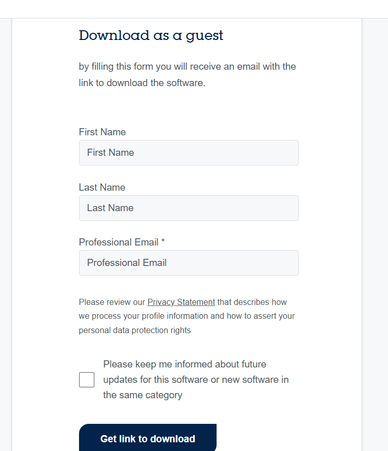

   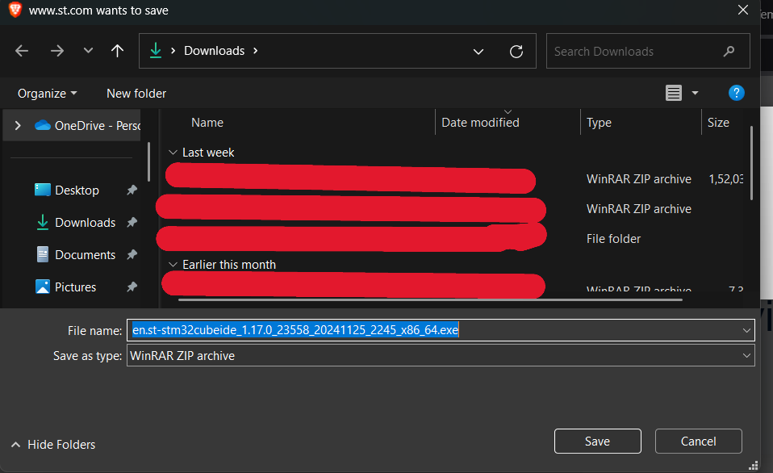

   - Monitor the download progress, and once completed, you will be ready to proceed with the installation.

   

2. **Run the Installer**
   - First, locate the downloaded installer file( **xx.zip** ) on your computer.
   - Double-click the file to initiate the installation process. If the file is compressed, use a file compression tool like 7-Zip or WinRAR to extract it first.
   - After extraction, double-click the extracted file to start the installer. Ensure you have administrative privileges to proceed with the installation.
   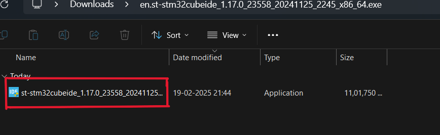

   - The installation wizard will guide you through the process. Click "Next" to continue, and it's recommended to install the software in the default directory for optimal performance.

   - If you prefer a custom installation path, click the "Browse" button to select your desired location, then click "Next" to proceed.
   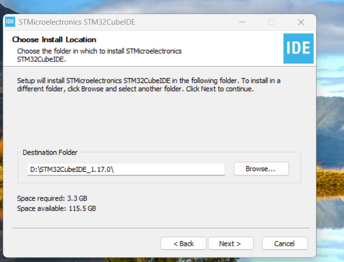

   - During the installation, you will be prompted to select drivers. It is advisable to select all available drivers to ensure full functionality.
   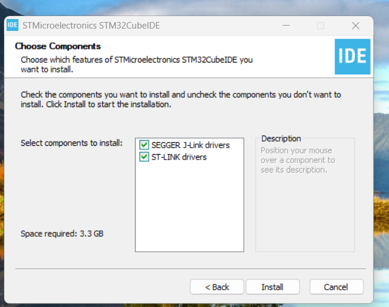

   - Continue by clicking "Next" to advance through the installation steps. The progress will be displayed on the screen.
   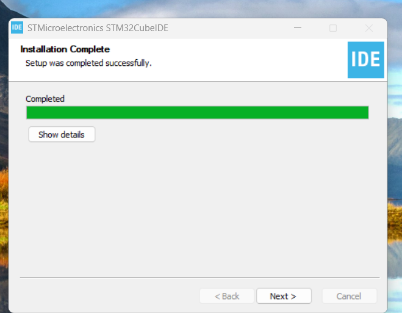

   - Once the installation is complete, a confirmation screen will appear. Click "Finish" to conclude the installation process.
   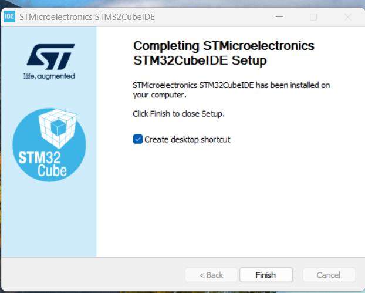

3. **Create a New Project**
   - Launch STM32CubeIDE by double-clicking its icon on your desktop or searching for it in your applications menu.
   - Once the IDE is open, navigate to the "File" menu and select "New" followed by "STM32 Project".
   - In the "Target Selection" window, choose your desired microcontroller or development board from the list. You can use the search bar to quickly find your specific model.
   - Click "Next" and provide a name for your project in the "Project Name" field. Choose a suitable location to save your project files.
   - Click "Finish" to create the new project. The IDE will generate the necessary files and open the project workspace.
   - Follow the on-screen instructions to configure your project settings, such as clock configuration, peripheral setup, and code generation options.

  
  
   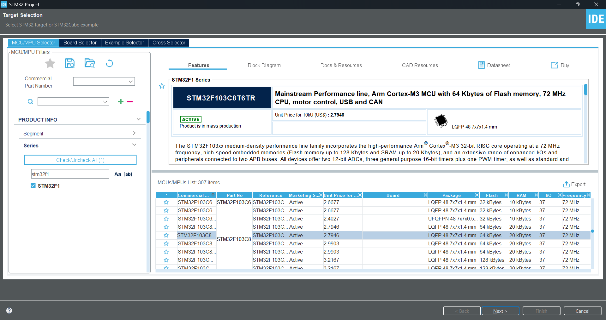

 

   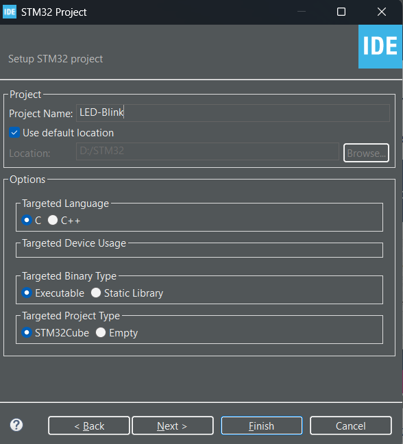
   
   - Now, you will see the project workspace.

   - Now, you can start coding your project.

---

## 🌐 Resources & References  
- [Introduction to STM32CubeIDE](https://wiki.st.com/stm32mcu/wiki/STM32CubeIDE:Introduction_to_STM32CubeIDE)
- [STM32CubeIDE Tutorial by Phipp's Electronics Documentation](https://www.phippselectronics.com/stm32-cube-ide-tutorial/)

## Contribution
We welcome contributions to this repository. Here are some ways you can contribute:
- Raise issues and submit pull requests.
- Share your feedback and suggestions.
- Star the repository to show your support.
- Share the repository with your friends and colleagues.
- Share your learnings and experiences with us.

For detailed guidelines on how to contribute, please visit our [Contribution Guide](https://github.com/iam-sandipmaity/learn-embedded-systems/blob/main/CONTRIBUTING.md).

**File Naming Convention**: `day-03.md`  
**Location**: `/week-01/content/day-03.md`

[Previous Day](day-02.md)   &nbsp;&nbsp;&nbsp;&nbsp;&nbsp;&nbsp;&nbsp;&nbsp;&nbsp;&nbsp;&nbsp;&nbsp;&nbsp;&nbsp;&nbsp;&nbsp;&nbsp;&nbsp;&nbsp;&nbsp;&nbsp;&nbsp;&nbsp;&nbsp;&nbsp;&nbsp;&nbsp;&nbsp;&nbsp;&nbsp;&nbsp;&nbsp;&nbsp;&nbsp;&nbsp;&nbsp;&nbsp;&nbsp;&nbsp;&nbsp;&nbsp;&nbsp;&nbsp;&nbsp;&nbsp;&nbsp;&nbsp;&nbsp;&nbsp;&nbsp;&nbsp;&nbsp;&nbsp;&nbsp;&nbsp;&nbsp;&nbsp;&nbsp;&nbsp;&nbsp;&nbsp;&nbsp;&nbsp;&nbsp;&nbsp;&nbsp;&nbsp;&nbsp;&nbsp;&nbsp;&nbsp;&nbsp;&nbsp;&nbsp;&nbsp;&nbsp;&nbsp;&nbsp;&nbsp;&nbsp;&nbsp;&nbsp;&nbsp;&nbsp;&nbsp;&nbsp;&nbsp;&nbsp;&nbsp;&nbsp;&nbsp;&nbsp; | &nbsp;&nbsp;&nbsp;&nbsp;&nbsp;&nbsp;&nbsp;&nbsp;&nbsp;&nbsp;&nbsp;&nbsp;&nbsp;&nbsp;&nbsp;&nbsp;&nbsp;&nbsp;&nbsp;&nbsp;&nbsp;&nbsp;&nbsp;&nbsp;&nbsp;&nbsp;&nbsp;&nbsp;&nbsp;&nbsp;&nbsp;&nbsp;&nbsp;&nbsp;&nbsp;&nbsp;&nbsp;&nbsp;&nbsp;&nbsp;&nbsp;&nbsp;&nbsp;&nbsp;&nbsp;&nbsp;&nbsp;&nbsp;&nbsp;&nbsp;&nbsp;&nbsp;&nbsp;&nbsp;&nbsp;&nbsp;&nbsp;&nbsp;&nbsp;&nbsp;&nbsp;&nbsp;&nbsp;&nbsp;&nbsp;&nbsp;&nbsp;&nbsp;&nbsp;&nbsp;&nbsp;&nbsp;&nbsp;&nbsp;&nbsp;&nbsp;&nbsp;&nbsp;&nbsp;&nbsp;&nbsp;&nbsp;&nbsp;&nbsp;&nbsp;&nbsp;&nbsp;&nbsp;&nbsp;&nbsp;&nbsp;&nbsp; [Next Day](day-04.md)

